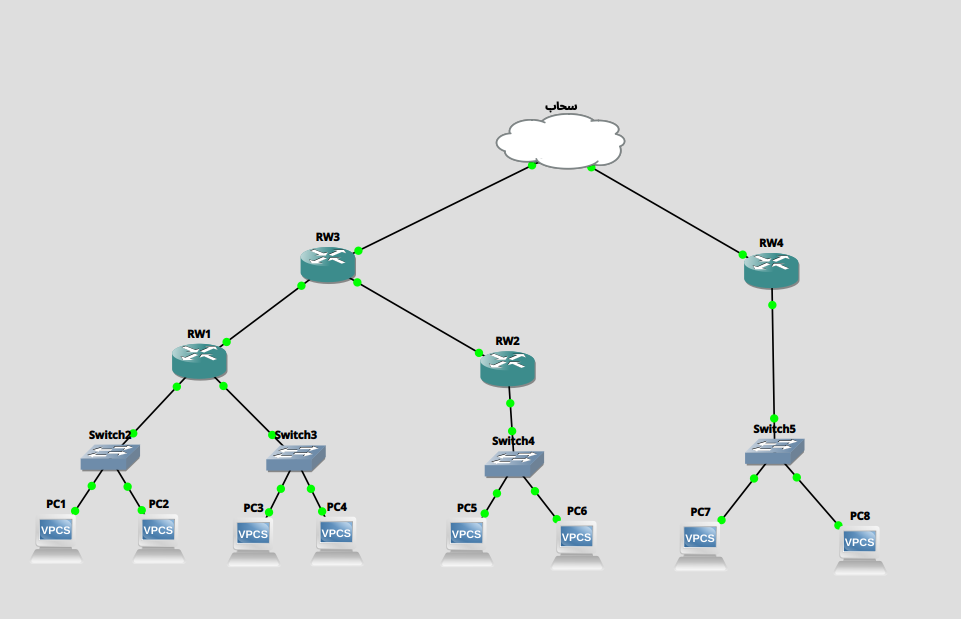
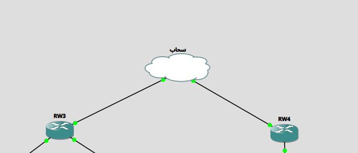
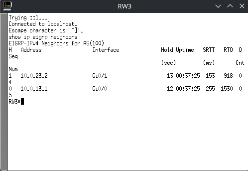
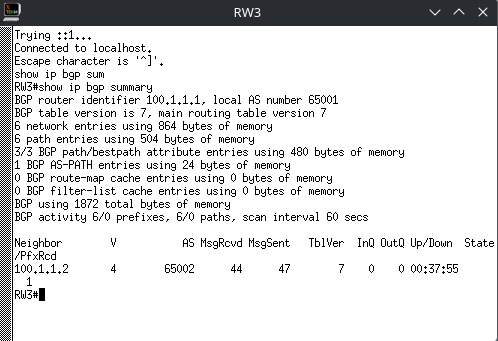
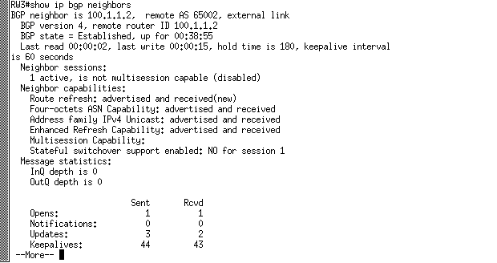
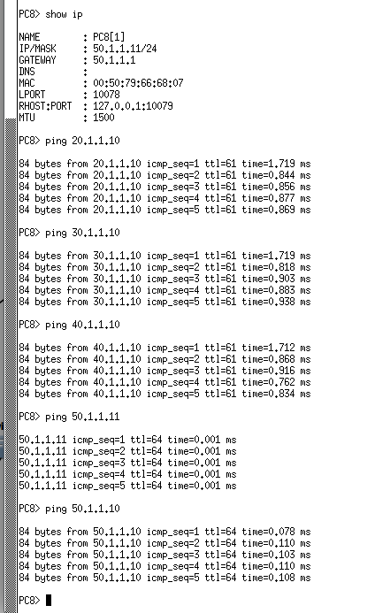

# Computer Networks Lab Report
## GNS3 Network Design with EIGRP and BGP

Abdelrahman Essam 8893

Seifeldin Ahmed 8927

---

# 1. Objective
The objective of this lab is to design and implement a multi-router network using GNS3, integrating:

- EIGRP for internal routing (Cairo network)
- BGP for external routing between Cairo and Alexandria
- IPv4 addressing and full end-to-end connectivity between all LANs

---

# 2. Network Topology Overview

The network consists of:

- RW1, RW2, RW3 (Cairo site – EIGRP domain)
- RW4 (Alexandria site – BGP domain)
- RW3 acts as the border router between EIGRP and BGP

**Topology Diagram Placeholder:**

 

---

# 3. IP Addressing Scheme

| Device | Interface | IP Address | Purpose |
|--------|----------|------------|----------|
| RW1 | G0/0 | 20.1.1.1/24 | Sales LAN |
| RW1 | G0/1 | 30.1.1.1/24 | HR LAN |
| RW1 | G0/2 | 10.0.13.1/24 | Link to RW3 |
| RW2 | G0/0 | 40.1.1.1/24 | IT LAN |
| RW2 | G0/1 | 10.0.23.2/24 | Link to RW3 |
| RW3 | G0/0 | 10.0.13.3/24 | Link to RW1 |
| RW3 | G0/1 | 10.0.23.3/24 | Link to RW2 |
| RW3 | G0/2 | 100.1.1.1/24 | BGP link to RW4 |
| RW4 | G0/0 | 100.1.1.2/24 | BGP link |
| RW4 | G0/1 | 50.1.1.1/24 | Operations LAN |

---

# 4. GNS3 Switch Configuration

A GNS3 Ethernet switch was used to provide Layer 2 connectivity between RW3 and RW4 for the BGP peering link. The switch operates as a transparent Layer 2 device and requires no additional configuration.

### Switch Connections:

```text
RW3 G0/2 → Switch
RW4 G0/0 → Switch
```

This configuration ensures both routers are in the same broadcast domain for BGP adjacency establishment.

**Screenshot Placeholder:**



---

# 5. EIGRP Configuration (RW1, RW2, RW3) EIGRP Configuration (RW1, RW2, RW3) EIGRP Configuration (RW1, RW2, RW3)

EIGRP AS 100 was configured for internal routing between Cairo routers.

### RW1 Configuration

```cisco
router eigrp 100
no auto-summary
network 20.1.1.0 0.0.0.255
network 30.1.1.0 0.0.0.255
network 10.0.13.0 0.0.0.255
```

### RW2 Configuration

```cisco
router eigrp 100
no auto-summary
network 40.1.1.0 0.0.0.255
network 10.0.23.0 0.0.0.255
```

### RW3 Configuration

```cisco
router eigrp 100
no auto-summary
network 10.0.13.0 0.0.0.255
network 10.0.23.0 0.0.0.255
```

### Verification Command:

```cisco
show ip eigrp neighbors
```

**Screenshot Placeholder:**



---

# 6. BGP Configuration (RW3 ↔ RW4)

BGP was used to connect Cairo and Alexandria networks.

### RW3 (AS 65001)

```cisco
router bgp 65001
neighbor 100.1.1.2 remote-as 65002
```

### RW4 (AS 65002)

```cisco
router bgp 65002
neighbor 100.1.1.1 remote-as 65001
network 50.1.1.0 mask 255.255.255.0
```

---

# 7. BGP Verification

### Command:

```cisco
show ip bgp summary
```

### Expected Output:

- State: **Established**
- MsgRcvd / MsgSent > 0

**Screenshot Placeholder:**




---

### Detailed BGP Debugging

```cisco
show ip bgp neighbors
```

Used to check:
- TCP connection state
- Reset reasons
- Hold timers

**Screenshot Placeholder:**



---

# 8. Connectivity Testing

### Ping Tests:

```bash
ping 20.1.1.10
ping 30.1.1.10
ping 40.1.1.10
ping 50.1.1.10
```

**Screenshot Placeholder:**




---

# 9. Troubleshooting Summary

Issues encountered:

- BGP stuck in "Active" state
- No ping between RW3 and RW4
- Cloud/bridge misconfiguration in Linux

### Root Causes:

- Incorrect bridge configuration
- Interface not properly connected in GNS3
- Layer 2 connectivity failure

### Fixes Applied:

- Replaced Cloud with correct bridge setup
- Verified interface assignments
- Reset BGP sessions

---

# 10. Conclusion

The network was successfully designed using a hybrid routing approach:

- EIGRP provided internal routing within Cairo
- BGP provided external connectivity between autonomous systems
- Full IPv4 connectivity was achieved between all LANs after resolving Layer 2 issues

---

# Appendix

### Useful Commands:

```cisco
show ip interface brief
show ip route
show ip eigrp neighbors
show ip bgp summary
show ip bgp neighbors
show arp
```

---

**End of Report**

